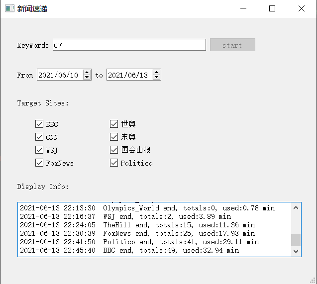
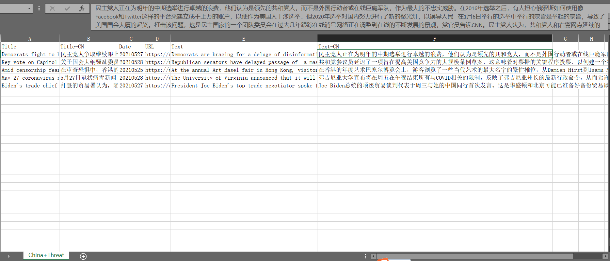

# News-Spider
国外新闻网站爬虫，并存储至Excel中

---
#### 一、主要特性
1. 支持界面操作
2. 支持时间段过滤
3. 支持多个关键词
4. 标题和正文附带谷歌机翻
5. 多线程并发加速

#### 二、支持站点：
1. 华尔街日报：https://www.wsj.com/
2. 福克斯新闻：https://www.foxnews.com/
3. CNN：https://edition.cnn.com/
4. BBC：https://www.bbc.com/
5. Olympic World：https://www.olympic.org/
6. Olympic Tokyo：https://tokyo2020.org/en/
7. 国会山报：https://thehill.com/
8. Politico：https://www.politico.com/

#### 三、技术关键词：
win10 + python 3.9 + requests + newpaper + selenium + pyside2 + beautifulsoup4 + jsonpath

#### 四、注意事项：梯子自备

#### 效果图：

---
### 持续更新中，若有问题欢迎 Issue 反馈，如果觉得对你有帮助，请顺手点个 Star 鼓励下让更多人看到，感谢支持！

## Q&A：
1. 关键包版本：
requests 2.25.1 + urllib3 1.25.8 + selenium 3.141.0 + chromedriver.exe 90.0.4430 + beautifulsoup4 4.9.3 + openpyxl 3.0.7 + PySide2 5.15.2 + newspaper3k 0.2.8 + jsonpath 0.82
   
2. Chrome 浏览器驱动下载地址：
http://npm.taobao.org/mirrors/chromedriver/

